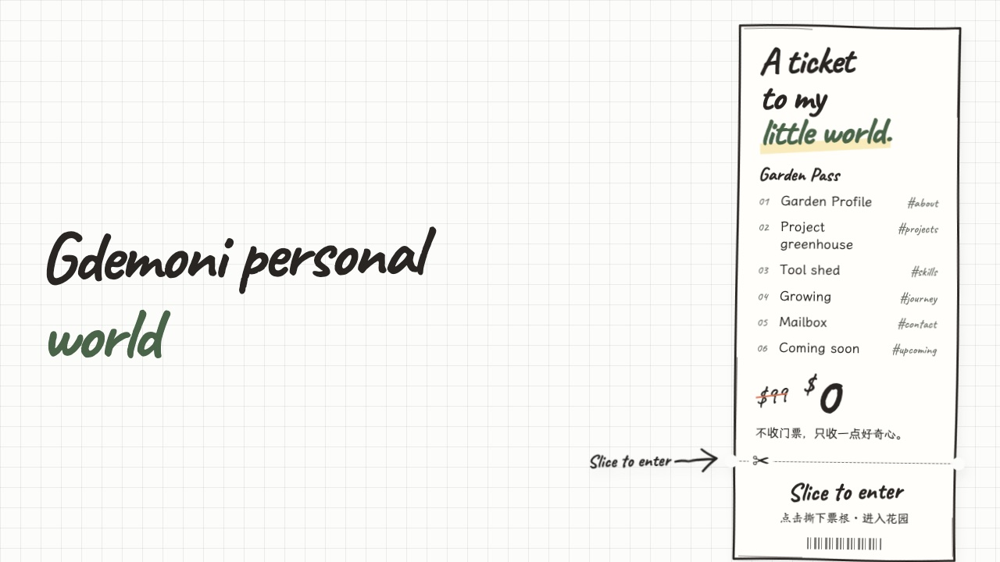
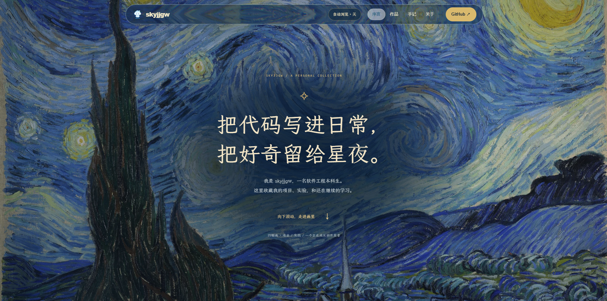

# Pieces-AI-website

> AI 时代下的个人数字名片。
>
> A personal digital business card for the AI era.

[→ English](README.md)

如果你对 Pieces Lab 感兴趣，想加入我们，请[点击这里](https://github.com/Pieces-lab/Join-Pieces)前往 **Join Pieces** 仓库。加入申请、Issue、Pull Request 和成员名单都在那里管理。

## 项目愿景

个人网站是一个属于自己的空间。它可以是一份简历、一座数字花园、一个作品集，也可以持续记录还在探索中的想法。Pieces Lab 希望每位成员都能有一个地方讲述自己的经历，展示项目和作品。这个仓库把这些个人空间汇集起来，让更多人认识网站背后的创作者。

## 个人网站 Template

个人网站可以有很多种样子。收集这些 Template，是为了让准备建立网站的人看到不同的自我介绍方式、项目组织方法和视觉表达，再找到适合自己的方向。每个 Template 都提供主页预览、在线链接、可用时的网站仓库，以及介绍页面结构和特点的独立文档。以后可以继续在 `templates/` 中加入更多人的个人网站。

### 001 · Gdemoni · Personal World · 互动数字花园



- **个人网站：** [zshgdemoni.me](https://zshgdemoni.me)
- **网站仓库：** [gdemoni/Gdemoni-personal](https://github.com/gdemoni/Gdemoni-personal)
- **X：** [@Gdemonizsh](https://x.com/Gdemonizsh)
- **Template 介绍：** [templates/zshgdemoni.me.md](templates/zshgdemoni.me.md)
- **特点：** 可撕门票作为入口，用花园叙事连接个人介绍、项目温室、工具棚、成长路径和信箱；项目细节、探索反馈与双语内容让网站像一个持续生长的个人空间。

### 002 · SKYJJGW · 星夜作品馆 · 互动个人展览



- **个人网站：** [skyjjgw.com](https://skyjjgw.com)
- **网站仓库：** [skyjjgw/skyjjgw-starry-museum](https://github.com/skyjjgw/skyjjgw-starry-museum)（个人站静态发布快照）
- **个人专用仓库：** [Pieces-lab/skyjjgw](https://github.com/Pieces-lab/skyjjgw)
- **X：** [@skyjjgw](https://x.com/skyjjgw)
- **邮箱：** [skyjjgw@gmail.com](mailto:skyjjgw@gmail.com)
- **可复用模板：** [Starry Museum](https://github.com/skyjjgw/starry-museum-portfolio)（独立的匿名示例版）
- **Template 介绍：** [templates/skyjjgw.com.md](templates/skyjjgw.com.md)
- **特点：** 以星夜画作为背景，用四幅立体画框连接个人介绍、项目、学习手记与关于页面；画框内可以展开作品、翻阅手记，并通过自动浏览、暂停动态和全屏入口控制浏览节奏。

## 如何收录你的网站

参考 [`templates/_template.md`](templates/_template.md) 准备介绍文档，并在两个版本的 README 中加入对应条目。完整提交步骤和截图要求见[参与贡献指南](CONTRIBUTING.zh-CN.md)。

## 加入 Pieces Lab

想成为组织成员，请先到 [Join Pieces](https://github.com/Pieces-lab/Join-Pieces) 按仓库说明提交申请：创建申请 Issue，提交关联该 Issue 的 Pull Request。维护者审核并合并后，会为成员提供组织内的个人专用仓库，用来记录经历、项目和作品。

## 许可协议

仓库中的原创文字采用 [CC BY 4.0](LICENSE) 许可。第三方参考资料和截图不在授权范围内；具体范围见许可文件开头。

## 仓库结构

```text
README.md                 英文项目介绍与个人网站 Template 展示
README.zh-CN.md           简体中文版
CONTRIBUTING.md           英文贡献指南
CONTRIBUTING.zh-CN.md     简体中文贡献指南
LICENSE                   CC BY 4.0 许可与适用范围
templates/_template.md    新增网站时使用的介绍模板
templates/zshgdemoni.me.md  Gdemoni Personal World 的独立介绍
templates/zshgdemoni.me-home.jpg  主页预览图
templates/skyjjgw.com.md   SKYJJGW 星夜作品馆的独立介绍
templates/skyjjgw.com-home.png  星夜作品馆首页预览图
```
