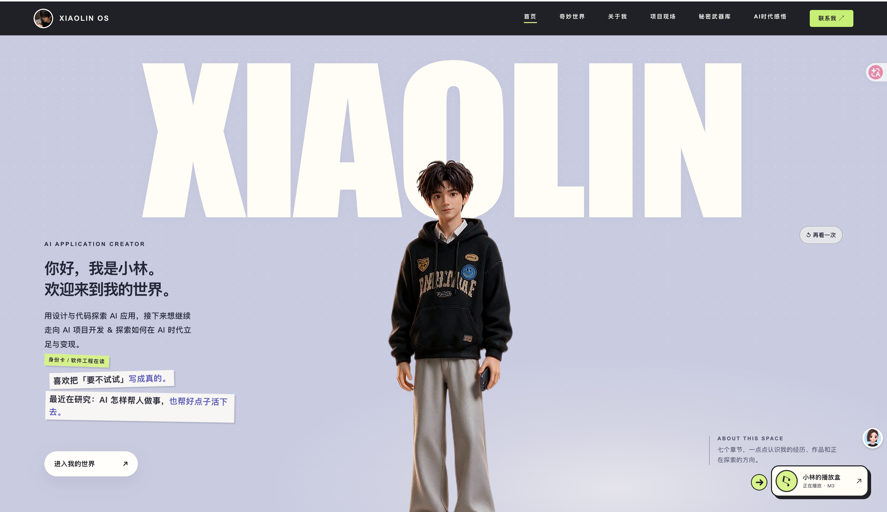

# 小林 / Xiaolin OS — 参考模板 #003

- 个人网站：<https://xiaolinyx.me/>
- 个人专用仓库：<https://github.com/Pieces-lab/xiaolin>
- 网站源码：[linyuchao123/xiaolin-os](https://github.com/linyuchao123/xiaolin-os)
- 一句话介绍：软件工程专业在读，用设计与代码把个人经历、AI 项目和仍在探索的想法组织成一座可互动的个人空间。

## 关于我

我是小林，一名软件工程专业的本科生，正在学习 AI 应用开发、智能体工作流与软件工程。比起只介绍使用过哪些工具，我更想展示自己怎样从一个问题出发，做出可以使用、可以继续改进的作品。

Xiaolin OS 收录我的个人介绍、项目案例和学习中的想法。网站把“好奇”和“动手”作为贯穿页面的线索，让访客可以从作品了解我，也看到项目仍在迭代的过程。

## 项目

| 项目 | 简介 | 链接 |
| --- | --- | --- |
| 数字心屿 | 结合数字人、语音对话、心理学知识检索与用户可控的长期记忆。 | [网站案例](https://xiaolinyx.me/projects/digital-human/) · [GitHub](https://github.com/linyuchao123/digital-human-companion) |
| AI 英语口语陪练 | 围绕面试、点餐和会议场景进行对话练习，提供发音与语法反馈。 | [GitHub](https://github.com/linyuchao123/AI-Spoken-English-Trainer) |
| 美容美业 CRM | 校企合作项目，围绕会员预约与门店经营管理设计。 | [网站案例](https://xiaolinyx.me/projects/beauty-crm/) |
| Xiaolinyx Mail | 基于 Cloud Mail 构建的个人域名邮箱服务。 | [网站案例](https://xiaolinyx.me/projects/xiaolinyx-mail/) · [GitHub](https://github.com/linyuchao123/xiaolinyx-mail) |
| Maptale | 探索在地图上记录、连接和分享旅行故事。 | [网站案例](https://xiaolinyx.me/projects/maptale/) · [GitHub](https://github.com/linyuchao123/Maptale) |

以上是网站目前展示的案例。项目的实际能力、状态与运行方式以各自的介绍和仓库为准。

## 作品

- **[Xiaolin OS](https://xiaolinyx.me/)**：可在桌面和手机上浏览的个人网站；网站源码与制作记录见 [GitHub](https://github.com/linyuchao123/xiaolin-os)。
- **[Pieces Lab 个人作品集](https://github.com/Pieces-lab/xiaolin)**：按主题整理个人介绍、项目入口与联系方式。

### 网站结构与设计特点

1. **人物开场**：浅紫色背景、醒目的 XIAOLIN 字样与人物形象构成首页；访客可以从这里进入各个章节。
2. **奇妙世界**：围绕人物排列可互动的兴趣与项目卡片，鼠标或触摸操作会带来不同反馈。
3. **关于我与项目现场**：个人经历、下一阶段方向和五个项目案例分别展开，不只停留在一张项目列表。
4. **工具与思考**：秘密武器库收录正在使用的工具，AI 时代感悟记录边学边做的想法。
5. **联系与结尾**：通过邮件和社交平台联系作者；访客可以自主开启音乐播放器，切换章节时继续播放。
6. **多设备浏览**：分别照顾桌面和手机布局，也支持键盘操作与减少动态效果的系统偏好。

网站使用 Astro 构建静态页面，交互部分使用 React、Three.js 与 GSAP；具体运行步骤见[网站仓库 README](https://github.com/linyuchao123/xiaolin-os#readme)。

## 联系方式

- 个人网站：<https://xiaolinyx.me/>
- GitHub：<https://github.com/linyuchao123>
- X：[@xiaolinyx123](https://x.com/xiaolinyx123)
- 邮箱：[476638303@qq.com](mailto:476638303@qq.com)

## 素材说明

首页截图由网站作者提供，用于此条目预览。截图中的人物形象、字体和其他网站素材不因收录而变更授权；来源与使用范围请参看[网站素材说明](https://github.com/linyuchao123/xiaolin-os#素材说明)及[个人作品集的素材说明](https://github.com/Pieces-lab/xiaolin/blob/main/ATTRIBUTION.md)。
